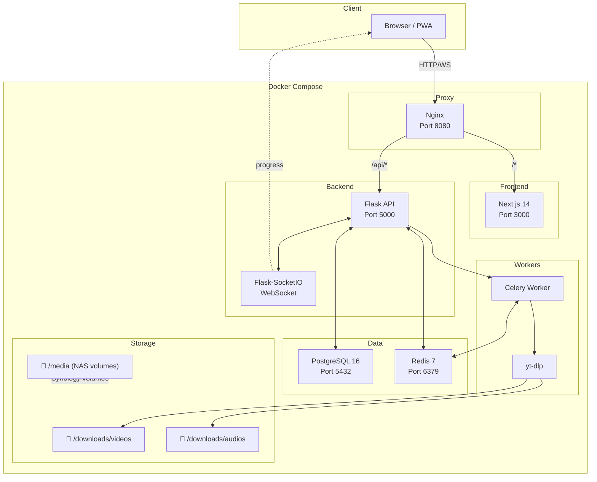

# Sidra Video Downloader

> A self-hosted, full-stack video downloader application built with Flask, Next.js, and PostgreSQL. Download videos and audio from YouTube and hundreds of other sites with a beautiful, modern interface.

---

## Features

- 🎬 **Video & Audio Downloads** — Download in any quality, from 4K to audio-only MP3
- 📋 **Playlist Support** — Download entire playlists with a single click
- 🔄 **Real-time Progress** — WebSocket-powered live download progress
- 📁 **Media Browser** — Browse and play downloaded files directly from the web UI
- 👥 **Multi-user Support** — Admin and regular user roles with JWT authentication
- 🎨 **Modern UI** — Responsive Next.js frontend with dark/light mode
- 🐳 **Docker Ready** — One-command deployment with Docker Compose
- 📦 **Synology NAS** — First-class support for Synology NAS deployment
- ⚙️ **Configurable** — Flexible settings for download paths, quality, and formats
- 📊 **Download History** — Track all downloads with search and filtering
- 🔔 **Notifications** — Real-time status updates via WebSocket
- 🛡️ **Secure** — JWT authentication, bcrypt password hashing, CORS protection

---

## Tech Stack

| Layer       | Technology                          |
| ----------- | ----------------------------------- |
| Frontend    | Next.js 14, React 18, Tailwind CSS |
| Backend     | Flask 3.x, Flask-SocketIO          |
| Database    | PostgreSQL 16                       |
| Cache/Queue | Redis 7, Celery 5                   |
| Downloader  | yt-dlp                             |
| Proxy       | Nginx                              |
| Container   | Docker, Docker Compose              |

---

## Architecture



---

## Quick Start

### Using Docker Compose (Recommended)

```bash
# 1. Clone the repository
git clone https://github.com/your-username/sidra-downloader.git
cd sidra-downloader

# 2. Copy and configure environment
cp .env.example .env
# Edit .env with your preferred settings

# 3. Build and start all services
docker compose up -d --build

# 4. Initialize the database
docker compose exec backend flask db upgrade

# 5. Create an admin user
docker compose exec backend python create_admin.py

# 6. Open in browser
# http://localhost:8080
```

### Local Development

See [DEVELOPMENT.md](./DEVELOPMENT.md) for detailed local development setup instructions.

### Synology NAS

See [SYNOLOGY.md](./SYNOLOGY.md) for Synology NAS deployment guide.

---

## Screenshots

> *Screenshots coming soon — the application features a modern, responsive interface with dark and light modes.*

| Dashboard | Download Progress | Media Browser |
| --------- | ----------------- | ------------- |
| *TBD*     | *TBD*             | *TBD*         |

| Settings  | User Management   | Download History |
| --------- | ----------------- | ---------------- |
| *TBD*     | *TBD*             | *TBD*            |

---

## Documentation

- [📖 Project Overview](./README.md) — You are here
- [🛠️ Development Setup](./DEVELOPMENT.md) — Local Windows development
- [🚀 Deployment Guide](./DEPLOYMENT.md) — Docker production deployment
- [📦 Synology Guide](./SYNOLOGY.md) — Synology NAS deployment
- [📡 API Reference](./API.md) — REST API documentation

---

## License

This project is licensed under the **MIT License**. See the [LICENSE](../LICENSE) file for details.

```
MIT License

Copyright (c) 2024 Sidra Video Downloader

Permission is hereby granted, free of charge, to any person obtaining a copy
of this software and associated documentation files (the "Software"), to deal
in the Software without restriction, including without limitation the rights
to use, copy, modify, merge, publish, distribute, sublicense, and/or sell
copies of the Software, and to permit persons to whom the Software is
furnished to do so, subject to the following conditions:

The above copyright notice and this permission notice shall be included in all
copies or substantial portions of the Software.
```
